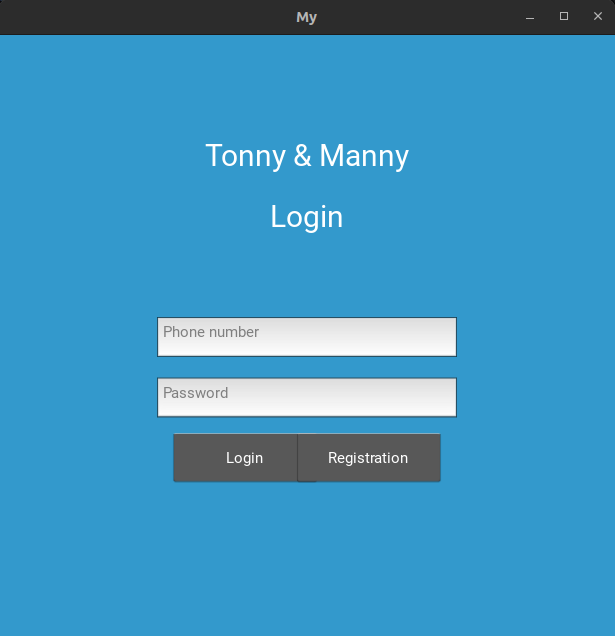
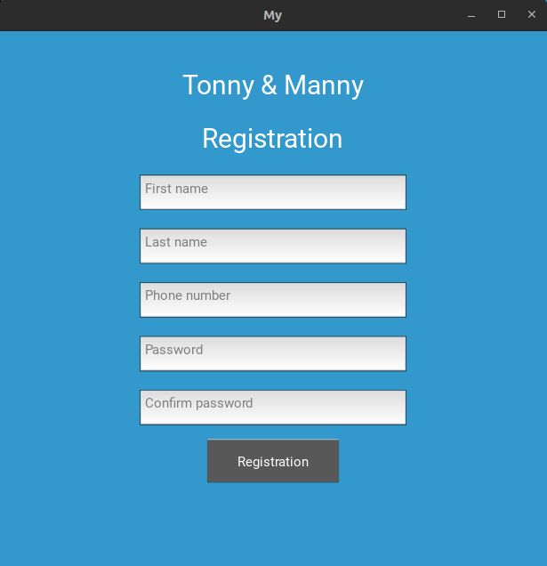
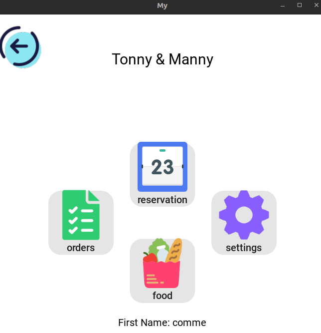

# Tonny & Manny

## Description
Tonny & Manny est une application de gestion de restaurant permettant aux utilisateurs de réserver des tables, de commander de la nourriture et des boissons en click and collect, ainsi que de modifier leurs paramètres utilisateur. En outre, l'application offre des fonctionnalités de gestion des stocks pour le restaurant.

## Technologies utilisées
- **SQLite**: Nous avons utilisé SQLite comme base de données pour aller vite dans le développement initial de l'application. Toutefois, pour une version finale, nous prévoyons de migrer vers une autre technologie de base de données plus robuste et évolutive.
- **Kivy**: Nous avons utilisé le framework Kivy en Python pour le développement de l'interface utilisateur. Kivy offre une approche flexible et efficace pour la création d'applications multiplateformes avec une interface utilisateur attrayante.

## Fonctionnalités principales
1. **Réservation de tables**: Les utilisateurs peuvent réserver des tables dans le restaurant en fonction de leur disponibilité ainsi que laisser un commantaire.
2. **Commande en click and collect**: Les utilisateurs peuvent passer des commandes de nourriture et de boissons via l'application pour un retrait ultérieur en click and collect ainsi que laisser un commantaire.
3. **Modification des paramètres utilisateur**: Les utilisateurs ont la possibilité de modifier leurs informations personnelles et leurs préférences dans l'application.
4. **Gestion des stocks**: Les fonctionnalités de gestion des stocks permettent au restaurant de suivre et de gérer efficacement les niveaux de stock de leurs produits.

## Accès à l'application
- **Connexion obligatoire**: Pour accéder à toutes les fonctionnalités de l'application, les utilisateurs doivent être connectés à leur compte utilisateur.
- **Responsive et cross-plateform**: L'application est conçue de manière responsive pour s'adapter à différents types d'appareils et est cross-plateforme, ce qui signifie qu'elle peut fonctionner sur différents systèmes d'exploitation comme Windows, macOS et Linux.

## Visuel

  

  

  

## Durée de développement
- **Durée initiale prévue**: 7 jours. Nous nous sommes fixé un défi de développement rapide pour réaliser le projet dans un laps de temps restreint.
- **Durée réelle de développement**: 4 jours. Nous avons réussi à terminer le projet plus rapidement que prévu, malgré le changement de technologie en cours de route, passant de Tkinter à Kivy pour l'interface utilisateur.

## Remarques
- Nous avons initialement choisi SQLite pour sa simplicité et sa rapidité de mise en place, mais nous prévoyons de migrer vers une solution de base de données plus adaptée pour une version finale de l'application.
- Le choix de Kivy comme framework d'interface utilisateur s'est avéré être une excellente décision en raison de sa flexibilité et de sa capacité à créer des interfaces utilisateur attrayantes pour notre application.

## Auteurs
FAURE Léo

LALDY-MAQUIHA Adan